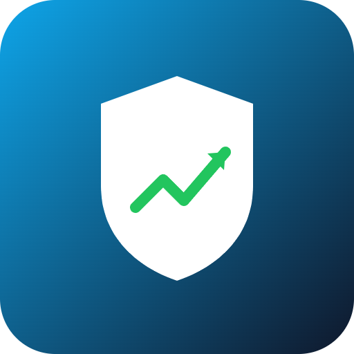

# SafeRun


An AI co-pilot that trades for crypto beginners with built-in guardrails.

## Overview
SafeRun is an AI agent that connects to a beginner's Solana wallet via session keys and executes small, rule-bound trades based on natural language goals like 'grow my SOL slowly with low risk'. Every trade comes with a plain-language explanation and hard-coded risk limits so new users never lose more than they're comfortable with.

## Problem
Beginners want to trade crypto but are overwhelmed by volatility, jargon, and the risk of losing money to scams or bad timing. Most tools assume chart literacy and DeFi know-how that newcomers simply don't have yet.

## Solution
SafeRun pairs an LLM-driven agent with a non-custodial session-key wallet on Solana. The agent trades strictly within user-set risk limits and explains every action in plain language, so users understand what happened and why, without needing to read charts.

## Features (MVP)
- Natural language goal setup ('low risk, grow slowly')
- Session-key based non-custodial wallet integration on Solana
- Hard risk limits: max trade size, daily loss cap, auto-pause on volatility spikes
- Plain-language trade explanations generated by LLM before and after execution
- Live dashboard showing portfolio health and AI decision log

## Tech Stack
- Anchor (Solana program framework)
- Solana wallet adapter (session keys)
- Jupiter aggregator API (trade execution)
- OpenAI / LLM API (goal parsing & explanations)
- Pyth price feeds (volatility monitoring)
- Helius RPC (chain access)

## How It Works
```
User Goal (text)
     |
     v
[ LLM Agent ] --parses goal into risk rules-->
     |
     v
[ Session Key Wallet ] --signs scoped swaps-->
     |
     v
[ Anchor Program ] --enforces limits-->
     |
     v
[ Jupiter Aggregator ] --executes trade-->
     |
     v
[ Pyth Price Feeds ] --watches volatility, can auto-pause-->
     |
     v
[ Dashboard ] --shows portfolio + decision log-->
```
The LLM agent converts a natural language goal into concrete, hard-coded risk parameters. A session key allows the agent to sign scoped swap transactions without taking custody of funds. An Anchor program enforces max trade size and daily loss caps on-chain. Trades route through the Jupiter aggregator for execution. Pyth price feeds continuously monitor volatility and can trigger an automatic pause. Every decision is logged and explained in plain language on a live dashboard.

## Roadmap
- Add support for more assets and DeFi strategies (staking, LPing)
- Introduce community-audited risk templates for different beginner profiles
- Launch mobile app with push notifications and voice-based goal setting

## Pitch
See [docs/pitch.pdf](docs/pitch.pdf) for the slide deck and [docs/pitch-script.md](docs/pitch-script.md) for the spoken pitch script.

## Team
- [Name] - Role - [GitHub/Twitter]
- [Name] - Role - [GitHub/Twitter]
- [Name] - Role - [GitHub/Twitter]

Built for the Colosseum hackathon.

---

🎬 Pitch video: [docs/pitch-video.mp4](docs/pitch-video.mp4)
